<div align="center">

  

  <br />
  <br />

  # 🌟 Kotlin Journey — বাংলায় Kotlin শেখার সেরা রোডম্যাপ

  <p align="center">
    <b>শূন্য থেকে প্রো-লেভেল পর্যন্ত Kotlin প্রোগ্রামিং শেখার আধুনিক, ইন্টারঅ্যাক্টিভ ও ভিজ্যুয়াল লার্নিং প্ল্যাটফর্ম</b>
  </p>

  <p align="center">
    <a href="#-কারিকুলাম-ও-রোডম্যাপ"></a>
    <a href="#-প্ল্যাটফর্ম-ফিচারসমূহ"></a>
    <a href="#-ইন্টারেক্টিভ-কোড-ও-ভিজ্যুয়ালাইজার"></a>
    <a href="#"></a>
  </p>

</div>

---

<br />

## 🧭 কারিকুলাম ও রোডম্যাপ (The Structured Roadmap)

> প্রতিটি মাইলস্টোনে রয়েছে রিয়েল লাইফ অ্যানালজি, কালার-কোডেড সিনট্যাক্স ও হ্যান্ডস-অন প্র্যাকটিস।

```mermaid
flowchart LR
    A["01. Fundamentals\nমৌলিক ভিত্তি"] --> B["02. Control Flow\nকন্ট্রোল ফ্লো"]
    B --> C["03. Functions\nফাংশন ও ল্যাম্বডা"]
    C --> D["04. Null Safety\nনাল সেফটি ও সুরক্ষাবিধি"]
    D --> E["05. Collections\nকালেকশনস ও ডেটা ফিল্টারিং"]
    E --> F["06. OOP\nঅবজেক্ট ও ক্লাস আর্কিটেকচার"]
    F --> G["07. Advanced\nএক্সটেনশন ও জেনেরিকস"]
    G --> H["08. Coroutines\nঅ্যাসিনক্রোনাস কনকারেন্সি"]

    classDef basic fill:#7f52ff18,stroke:#7f52ff,stroke-width:2px,color:#fff;
    classDef inter fill:#f43f5e18,stroke:#f43f5e,stroke-width:2px,color:#fff;
    classDef adv fill:#10b98118,stroke:#10b981,stroke-width:2px,color:#fff;

    class A,B,C basic;
    class D,E,F inter;
    class G,H adv;
```



<br />

| পর্যায় | মাইলস্টোন ও টপিক | স্তর | প্রধান শিক্ষা ও আলোচ্য বিষয় |
| :---: | :--- | :---: | :--- |
| **01** | **🌱 Fundamentals (মৌলিক ভিত্তি)** | `বিগিনার` | ভেরিয়েবল (`val` vs `var`), ডেটা টাইপ, টাইপ ইনফারেন্স, স্ট্রিং টেমপ্লেট ও ইনপুট-আউটপুট |
| **02** | **🔀 Control Flow (লজিক ও শর্ত)** | `বিগিনার` | `if-else` এক্সপ্রেশন, এক্সক্লুসিভ `when` স্টেটমেন্ট, স্মার্ট লুপস (`for`/`while`) ও রেঞ্জ |
| **03** | **⚡ Functions (কার্যকরী ফাংশন)** | `বিগিনার` | Named & Default Arguments, Single-expression ফাংশন, Vararg প্যারামিটার, ল্যাম্বডা |
| **04** | **🛡️ Null Safety (নাল নিরাপত্তা)** | `ইন্টারমিডিয়েট` | Nullable Types (`?`), Safe Call (`?.`), Elvis Operator (`?:`), Not-null Assertion (`!!`) |
| **05** | **📦 Collections (ডেটা কালেকশনস)** | `ইন্টারমিডিয়েট` | List, Set, Map, Read-only vs Mutable কালেকশন, হায়ার-অর্ডার ফিল্টারিং (`map`, `filter`) |
| **06** | **🏛️ OOP (অবজেক্ট ওরিয়েন্টেড)** | `ইন্টারমিডিয়েট` | ক্লাস, কনস্ট্রাক্টর, Data Class, ইন্টারফেস, ইনহেরিটেন্স এবং অ্যাবস্ট্রাকশন |
| **07** | **🚀 Advanced (অ্যাডভান্সড টেকনিক)** | `অ্যাডভান্সড` | Extension Functions, Sealed Classes & Interfaces, Generics (`<T>`), Infix ফাংশন |
| **08** | **🌀 Coroutines (অ্যাসিনক্রোনাস)** | `অ্যাডভান্সড` | আধুনিক কনকারেন্সি, `suspend` ফাংশন, Dispatchers, Structured Concurrency ও Flow |

---

<br />

## 🎨 প্ল্যাটফর্ম ফিচারসমূহ (Visual & Interactive Highlights)

<table>
  <tr>
    <td width="50%" valign="top">
      <h3>🧠 ইন্টারঅ্যাক্টিভ মেমোরি পাত্র সিমুলেশন</h3>
      <p>কোডিং বইয়ের শুধু লেখা নয়, লাইভ ইউজার ইন্টারফেস দিয়ে দেখা যায় <code>val</code> (লক করা স্থির মান) এবং <code>var</code> (উন্মুক্ত পরিবর্তনযোগ্য মান) কীভাবে র‍্যাম বা মেমোরিতে কাজ করে। ভুল পরিবর্তন করার চেষ্টা করলে সাথে সাথে ভিজ্যুয়াল অ্যালার্ট প্রদর্শিত হয়।</p>
    </td>
    <td width="50%" valign="top">
      <h3>🌈 কালার-কোডেড সিনট্যাক্স আর্কিটেকচার</h3>
      <p>সিনট্যাক্স বোঝার সুবিধার জন্য প্রতিটি উপাদান আলাদা রঙে হাইলাইট করা:</p>
      <ul>
        <li><code>val</code> / <code>var</code> / <code>fun</code> ➔ <b>পার্পল কি-ওয়ার্ড</b></li>
        <li><code>Int</code> / <code>String</code> / <code>Double</code> ➔ <b>স্কাই ব্লু ডেটা টাইপ</b></li>
        <li><code>"Hello"</code> / <code>'A'</code> ➔ <b>গ্রিন স্ট্রিং ও ক্যারাক্টার</b></li>
        <li><code>println()</code> / <code>main()</code> ➔ <b>অরেঞ্জ মেথড কল</b></li>
      </ul>
    </td>
  </tr>
  <tr>
    <td width="50%" valign="top">
      <h3>⚠️ কমন মিস্টেক্স ও সঠিক সমাধান</h3>
      <p>নতুনদের জন্য প্রতিটি লেসনের নিচে সাধারণ ভুলসমূহ (যেমন: <i>Val cannot be reassigned</i> বা <i>Null Pointer Exception</i>) সুন্দর <b>লাল ❌ এবং সবুজ ✅ কার্ডে</b> তুলনা করে বোঝানো হয়েছে।</p>
    </td>
    <td width="50%" valign="top">
      <h3>🎯 হ্যান্ডস-অন প্র্যাকটিস চ্যালেঞ্জ</h3>
      <p>প্রতিটি অধ্যায়ের শেষে রিয়েল-ওয়ার্ল্ড প্রোগ্রামিং সমস্যা এবং পাশে তার <b>Expected Terminal Output</b> দেওয়া থাকে, যাতে শিক্ষার্থীরা নিজে প্র্যাকটিস করে ফলাফল মিলিয়ে নিতে পারে।</p>
    </td>
  </tr>
</table>

---

<br />

## 💻 ইন্টারঅ্যাক্টিভ কোড ও ভিজ্যুয়ালাইজার

### 🧪 সিনট্যাক্স প্রিভিউ (Syntax Highlight Sample)
```kotlin
fun main() {
    // 🔒 অপরিবর্তনযোগ্য ভেরিয়েবল (Immutable)
    val appName: String = "Kotlin Journey"
    
    // 🔓 পরিবর্তনযোগ্য ভেরিয়েবল (Mutable)
    var completedLessons: Int = 10
    completedLessons++

    // 💡 আধুনিক স্ট্রিং টেমপ্লেট
    println("স্বাগতম $appName-এ! আপনি সম্পন্ন করেছেন $completedLessons টি লেসন।")
}
```

### 🖥️ আউটপুট কনসোল (Terminal Output)
```text
┌── TERMINAL OUTPUT ─────────────────────────────────────────────┐
│ স্বাগতম Kotlin Journey-এ! আপনি সম্পন্ন করেছেন 11 টি লেসন।       │
└────────────────────────────────────────────────────────────────┘
```

---

<br />

## 🎯 এই প্ল্যাটফর্মটি কাদের জন্য?

* 📱 **অ্যান্ড্রয়েড ডেভেলপার:** যারা আধুনিক Jetpack Compose বা Native Android অ্যাপ তৈরির জন্য মজবুত ভিত্তি খুঁজছেন।
* 🎓 **বিশ্ববিদ্যালয় ও কলেজ শিক্ষার্থী:** যাদের প্রাতিষ্ঠানিক কোর্সে অবজেক্ট ওরিয়েন্টেড প্রোগ্রামিং বা আধুনিক ল্যাঙ্গুয়েজ শেখা প্রয়োজন।
* 🔄 **Java থেকে রূপান্তরকারী:** যারা Java-এর অতিরিক্ত বয়লারপ্লেট কোড বাদ দিয়ে আধুনিক ও সংক্ষিপ্ত কোডিংয়ে অভ্যস্ত হতে চান।
* 🇧🇩 **বাংলা ভাষাভাষী লার্নার্স:** যারা বিদেশি বই বা কঠিন ইংরেজির বদলে নিজের মাতৃভাষায় গভীর প্রোগ্রামিং কনসেপ্ট আয়ত্ত করতে চান।

---

<div align="center">
  <br />
  <p><b>✨ বাংলায় কোডিং শিখুন, বিশ্বমানের দক্ষতা গড়ুন ✨</b></p>
  <p><i>Made with passion for the developer community.</i></p>
</div>
